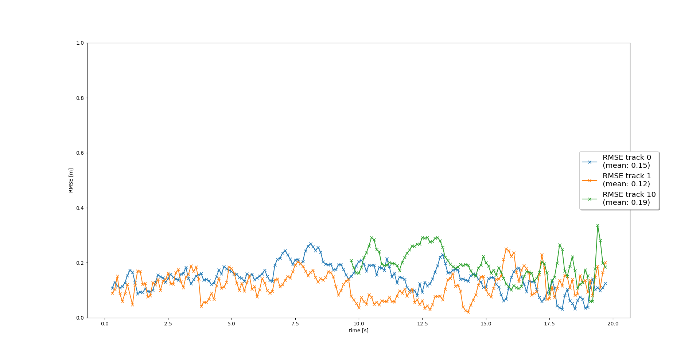

# Sensor Fusion and Object Tracking

This project serves as the culminating assignment for the second course of the Udacity program (refer to the [license](LICENSE.md) 
for details). The primary focus of the project is the implementation of the Kalman Filter to effectively track objects through a four-step process:
## Preperation

the construction of the project folders as the following:

📦project 
 ┣ 📂dataset --> contains the Waymo Open Dataset sequences  
 ┃ 
 ┣ 📂misc 
 ┃ ┣ evaluation.py --> plot functions for tracking visualization and RMSE calculation 
 ┃ ┣ helpers.py --> misc. helper functions, e.g. for loading / saving binary files 
 ┃ ┗ objdet_tools.py --> object detection functions without student tasks 
 ┃ ┗ params.py --> parameter file for the tracking part 
 ┃  
 ┣ 📂results --> binary files with pre-computed intermediate results download it and extract it from [here](https://drive.google.com/drive/folders/1IkqFGYTF6Fh_d8J3UjQOSNJ2V42UDZpO) 
 ┃  
 ┣ 📂student  
 ┃ ┣ association.py --> data association logic for assigning measurements to tracks incl. student tasks  
 ┃ ┣ filter.py --> extended Kalman filter implementation incl. student tasks  
 ┃ ┣ measurements.py --> sensor and measurement classes for camera and lidar incl. student tasks  
 ┃ ┣ objdet_detect.py --> model-based object detection incl. student tasks  
 ┃ ┣ objdet_eval.py --> performance assessment for object detection incl. student tasks  
 ┃ ┣ objdet_pcl.py --> point-cloud functions, e.g. for birds-eye view incl. student tasks  
 ┃ ┗ trackmanagement.py --> track and track management classes incl. student tasks   
 ┃  
 ┣ 📂tools --> external tools 
 ┃ ┣ 📂objdet_models --> models for object detection 
 ┃ ┃ ┃ 
 ┃ ┃ ┣ 📂darknet 
 ┃ ┃ ┃ ┣ 📂config 
 ┃ ┃ ┃ ┣ 📂models --> darknet / yolo model class and tools 
 ┃ ┃ ┃ ┣ 📂pretrained --> copy pre-trained model file here 
 ┃ ┃ ┃ ┃ ┗ complex_yolov4_mse_loss.pth 
 ┃ ┃ ┃ ┣ ??utils --> various helper functions 
 ┃ ┃ ┃ 
 ┃ ┃ ┗ 📂resnet 
 ┃ ┃ ┃ ┣ 📂models --> fpn_resnet model class and tools 
 ┃ ┃ ┃ ┣ 📂pretrained --> copy pre-trained model file here  
 ┃ ┃ ┃ ┃ ┗ fpn_resnet_18_epoch_300.pth  
 ┃ ┃ ┃ ┣ 📂utils --> various helper functions 
 ┃ ┃ ┃ 
 ┃ ┗ 📂waymo_reader --> functions for light-weight loading of Waymo sequences 
 ┃ 
 ┣ basic_loop.py 
 ┣ loop_over_dataset.py 

In dataset file you could downlaod the files from this [link](https://console.cloud.google.com/storage/browser/waymo_open_dataset_v_1_2_0_individual_files/training?pageState=(%22StorageObjectListTable%22:(%22f%22:%22%255B%255D%22))&prefix=&forceOnObjectsSortingFiltering=false)

### Waymo Open Dataset Reader
The Waymo Open Dataset Reader is a very convenient toolbox that allows you to access sequences from the Waymo Open Dataset without the need of installing all of the heavy-weight dependencies that come along with the official toolbox. The installation instructions can be found in `tools/waymo_reader/README.md`. 

### Waymo Open Dataset Files
This project makes use of three different sequences to illustrate the concepts of object detection and tracking. These are: 
- Sequence 1 : `training_segment-1005081002024129653_5313_150_5333_150_with_camera_labels.tfrecord`
- Sequence 2 : `training_segment-10072231702153043603_5725_000_5745_000_with_camera_labels.tfrecord`
- Sequence 3 : `training_segment-10963653239323173269_1924_000_1944_000_with_camera_labels.tfrecord`

To download these files, you will have to register with Waymo Open Dataset first: [Open Dataset – Waymo](https://waymo.com/open/terms), if you have not already, making sure to note "Udacity" as your institution.

Once you have done so, please [click here](https://console.cloud.google.com/storage/browser/waymo_open_dataset_v_1_2_0_individual_files) to access the Google Cloud Container that holds all the sequences. Once you have been cleared for access by Waymo (which might take up to 48 hours), you can download the individual sequences. 

### Pre-Trained Models
The object detection methods used in this project use pre-trained models which have been provided by the original authors. They can be downloaded [here](https://drive.google.com/file/d/1Pqx7sShlqKSGmvshTYbNDcUEYyZwfn3A/view?usp=sharing) (darknet) and [here](https://drive.google.com/file/d/1RcEfUIF1pzDZco8PJkZ10OL-wLL2usEj/view?usp=sharing) (fpn_resnet). Once downloaded, please copy the model files into the paths `/tools/objdet_models/darknet/pretrained` and `/tools/objdet_models/fpn_resnet/pretrained` respectively.

### Package Requirements
All dependencies required for the project have been listed in the file `requirements.txt`. You may either install them one-by-one using pip or you can use the following command to install them all at once: 
`pip3 install -r requirements.txt` 

# Task 1
### implement an EKF to track a single real-world target with lidar measurement input over time!
**Task preperation** 

in the file `loop_over_dataset.py`we apply the following sittings:

- `data_filename = 'training_segment-10072231702153043603_5725_000_5745_000_with_camera_labels.tfrecord'`
- `show_only_frames = [150, 200]`
- `configs_det = det.load_configs(model_name='fpn_resnet')`
- `configs_det.lim_y = [-5, 10]`
- `exec_detection = []`
- `exec_tracking = ['perform_tracking']`
- `exec_visualization = ['show_tracks']`

I the file `student/filter.py` we implement `redict()` and `update()` fucntions for an EKE. 
In addition we implemened `F()` and `Q()`

To implement them we utilized `gamma()` and `s()` functions where: 
 
 

In addition we called `get_hx()` and `get_H` from `students/measurements.py` and used `params.dt` to get the time step.

## results

we could get a results by run the file `loop_over_dataset.py`, as we see in the following image, the trarget traking result is work:

 

The plot of the mean RMSE: 

 

# Tast 2
### rack management to initialize and delete tracks, set a track state and a track score.

In `loop_over_dataset.py` we update the following parameters:
- `show_only_frames = [65, 100]`
- `configs_det.lim_y = [-5, 15]`

In `student/trackmanagement.py` we appleid the following:
In `mesurement.py` we initialized `track.x` and `track.P` and used `params.window` to update the socre using the following equations:

to decreas the score: 
 

to increase the score:

 

In addition we update the cor to confirmed if the track score bigger than thresholed where we used `params.confirmed_threshold` as a thresholed to update the car to confirmed (in our work we used `params.confirmed_threshold = 0.8`).

## Results
by run the file `loop_over_dataset.py` we got the following results: 

https://user-images.githubusercontent.com/84534790/235970849-fa372014-9963-40b1-b788-8d1d1e82016f.mp4

The plot of the mean RMSE: 
 

# Task 3
### Implement a single nearest neighbor data association to associate measurements to tracks

I the following task we update the parameters at `loop_over_dataset.py` as the following: 

- `data_filename = 'training_segment-1005081002024129653_5313_150_5333_150_with_camera_labels.tfrecord'`
- `show_only_frames = [0, 200]`
- `configs_det.lim_y = [-25, 25]`

Thsi task concerns its implementaiton on `student/association.py` file 
in the function `associate()` we replaced the association_matrix on Mahalanobis distances for all tracks `track_list` 
and all measurements `meas_list`

In addition we used `Mhd()` function to implement Mahalanbis distace between tracks, and updated the `unassigned_meas` and `unassigned_tracks`
In the funtion `get_closest_track_and_meas()` we extracted the minumum `association_matrix` to delet it.

## Results
by run the file `loop_over_dataset.py` we got the following results: 
The car detection shown in the followin vedio: 

https://user-images.githubusercontent.com/84534790/235971068-202448a6-c47e-4e85-b442-9080601cd337.mp4

The plot of the mean RMSE: 
 

# Task 4
### nonlinear camera measurement model

This task implemented at `student/measurements.py` 

In `Sensor` class we implemented `in_fov()` function to check if the track inside the range of camera acording to the sensor cordinates.

## Results
by run the file `loop_over_dataset.py` we got the following results: 
The car detection shown in the followin vedio: 

https://user-images.githubusercontent.com/84534790/235971164-854e42cc-b6d4-4fa5-be4c-039de7e0a4b4.mp4

The plot of the mean RMSE: 
 

# Summary
As we see we could synchnorize between sensors using deep learning and we could improve the perception of the tracks.

Kalman filter also very essential preossure to improve our predection to the track and its trajectories.

We could also improve the results by update the parameters as `confirmed_threshold` and `delete_threshold`
we could also update this parameters in the file `misc/params.py`

# license
[license](LICENSE.md) 
